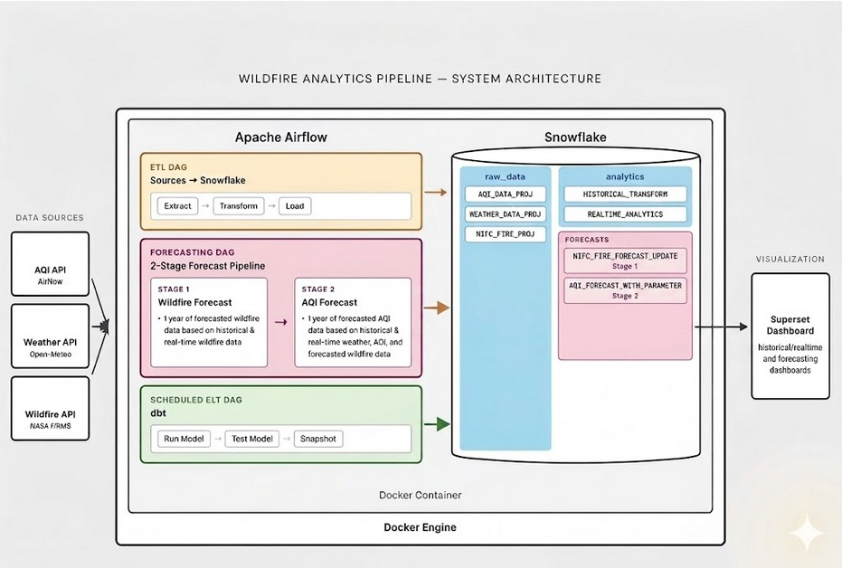
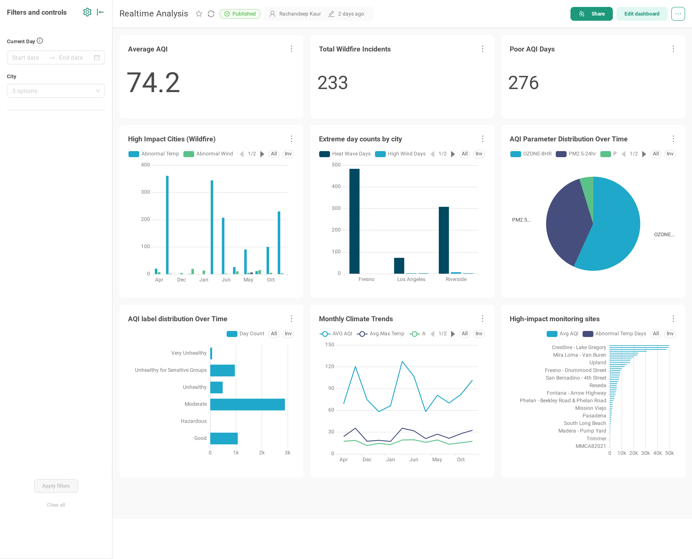
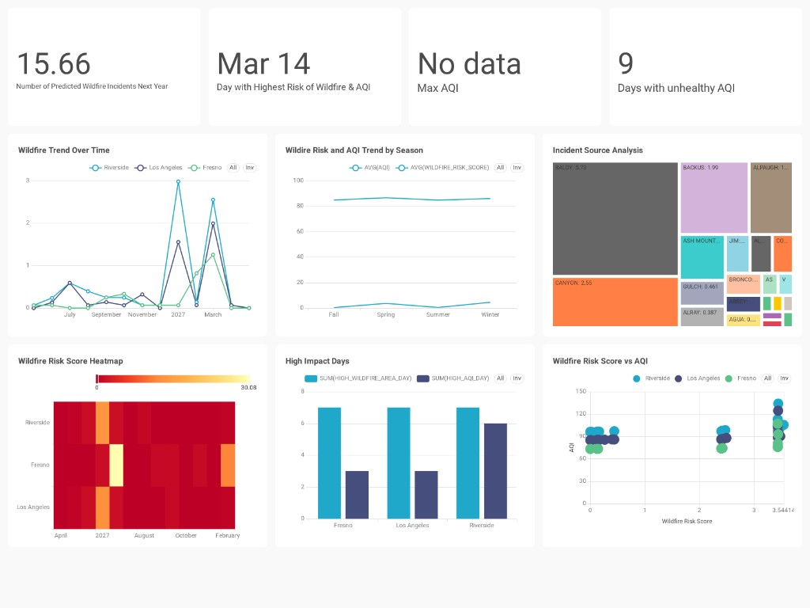

# Real Time Wildfire Risk and Air Quality Prediction System for California 

A two-stage predictive analytics system for **Los Angeles, Fresno, and Riverside** that (1) forecasts wildfire activity from historical wildfires and weather, then (2) feeds those wildfire forecasts together with weather and air-quality observations into an AQI forecast. Everything is wired through **Snowflake, Apache Airflow, and dbt**, with the results surfaced in a **Preset dashboard** covering wildfire risk, AQI forecasts, and environmental conditions across California.

The motivation: California's increasingly dry climate has driven a spike in wildfires, and those wildfires visibly degrade air quality and public health. Wildfire reports already lean on AQI and weather signals to describe severity, so we wanted to make that relationship explicit and use it to give residents and first responders a usable early-warning view.

## What it does

- Ingests **5 years of historical** weather (Open-Meteo), air quality (AirNow file product), and wildfire perimeters (NIFC WFIGS) per city.
- Runs **daily incremental** jobs for the same three sources to keep things fresh.
- Generates **forward-looking forecasts**:
  - Wildfire activity (incident count, acres burned, common incident/agency/source) using year-over-year level scaling + seasonal patterns.
  - AQI per pollutant parameter, driven by the wildfire forecast and recent weather.
- Models everything in dbt into a **transform → analytics → snapshot** stack with tests on every grain.

Cities in scope: **Los Angeles, Fresno, Riverside**.

## Architecture



## Dashboards

The final analytics layer is surfaced through **Preset (Apache Superset)** dashboards covering historical, real-time, and forecasted wildfire and AQI views.

### Realtime Analysis

**[Open the live dashboard →](https://c7d5b8eb.us2a.app.preset.io/superset/dashboard/9/?native_filters_key=gkzrUD01yaM&standalone=1)**



### Wildfire & AQI Forecast

**[Open the live dashboard →](https://bf1a2693.us2a.app.preset.io/superset/dashboard/12/?native_filters_key=C3TWozygJvY)**



## Stack

| Layer              | Tool                                                   |
|--------------------|--------------------------------------------------------|
| Orchestration      | Apache Airflow (TaskFlow API, dynamic task mapping)    |
| Warehouse          | Snowflake                                              |
| Transform / ELT    | dbt (`build_mau` project, with `dbt_utils`)            |
| Forecasting        | Python — pandas, numpy (no heavy ML, just signals)     |
| Visualization      | Preset (Apache Superset)                               |
| External APIs      | AirNow, Open-Meteo, NIFC ArcGIS FeatureServer          |

## Repo layout

```
.
├── dags/                              # All Airflow DAGs
│   ├── ETL_AQI_historical.py          # 5y AirNow AQI backfill (per-city, 60km radius)
│   ├── ETL_AQI_realtime_incremental.py
│   ├── ETL_open_metro_historical.py   # 5y weather backfill
│   ├── ETL_open_metro_realtime_incremental.py
│   ├── NIFC_Fire_historical.py        # NIFC perimeter backfill
│   ├── NIFC_Fire_realtime_incremental.py
│   ├── NIFC_Fire_Forecast.py          # Wildfire YoY + seasonal forecast
│   ├── AQI_Forecast.py                # Simple city-level AQI forecast
│   ├── aqi_forecast_with_parameter.py # AQI forecast by pollutant parameter
│   └── build_elt_with_dbt.py          # dbt run → test → snapshot
├── dbt/
│   ├── dbt_project.yml                # Project name: build_mau
│   ├── models/
│   │   ├── sources.yml                # raw + analytics source defs
│   │   ├── schema.yml                 # column tests + uniqueness combos
│   │   ├── transform/                 # ephemeral derived layer
│   │   │   ├── historical_transform.sql
│   │   │   └── forecast_transform.sql
│   │   └── analytics/                 # materialized tables
│   │       ├── historical_analytics.sql
│   │       ├── forecast_analytics.sql
│   │       └── realtime_analytics.sql
│   ├── snapshots/                     # Type-2 snapshots for analytics tables
│   └── packages.yml                   # dbt-labs/dbt_utils
├── .env.example                       # Airflow vars + Snowflake conn template
└── README.md
```

## Data model (Snowflake)

- **`raw`**
  - `weather_data_proj` — daily weather per city
  - `aqi_data_proj` — daily AQI observations matched to nearest city (Haversine, 60 km)
  - `nifc_fire_proj` — daily wildfire activity aggregated per city
- **`analytics`**
  - `nifc_fire_forecast_updated` — forward wildfire forecast
  - `aqi_forecast_with_parameter` — forward AQI forecast per pollutant
  - `historical_analytics`, `forecast_analytics`, `realtime_analytics` — built by dbt
- **`snapshot`**
  - Type-2 snapshots of historical + forecasting analytics for change tracking

The dbt transform layer is where the interesting features live: season buckets, comfort score, AQI category labels, wildfire risk score, heat-wave / high-wind / high-UV flags, cumulative incident counters, and impact tiers.

## How it runs

Daily, in this order (all schedules are UTC):

1. Incremental ETL DAGs refresh `raw.*` tables.
2. Wildfire forecast → AQI forecast (`aqi_forecast` runs 5 minutes after wildfire forecast).
3. `BuildELT_dbt_proj` kicks off ~15 minutes after that and runs:
   ```
   dbt run  →  dbt test  →  dbt snapshot
   ```

## Getting started

You'll need: Airflow (with the Snowflake provider), a Snowflake account, and dbt (Snowflake adapter).

1. Copy the env template and fill in your values:
   ```bash
   cp .env.example .env
   ```
   You'll need an AirNow API key and a Snowflake connection string.

2. Create the Airflow connection `snowflake_con` from the URL in `.env`, and register the city lat/lon Airflow Variables.

3. Install dbt deps:
   ```bash
   cd dbt && dbt deps
   ```

4. Drop the DAGs folder into your Airflow `dags_folder`, mount `dbt/` at `/opt/airflow/dbt` (the path `build_elt_with_dbt.py` expects), and unpause the DAGs.

5. Trigger the historical DAGs once for the initial backfill, then let the incremental + forecast + dbt DAGs run on schedule.

